搭建一个 github托管的blog
<!--more-->

## 搭建博客
首先来讲如何在github上搭建一个博客。网上这种文章简直不要太多，但是还是来写一下吧(精致)。大佬请直接跳过

### 申请账号
真的是从零开始的呢。
首先去github申请github账号。
按要求填写就行了。。
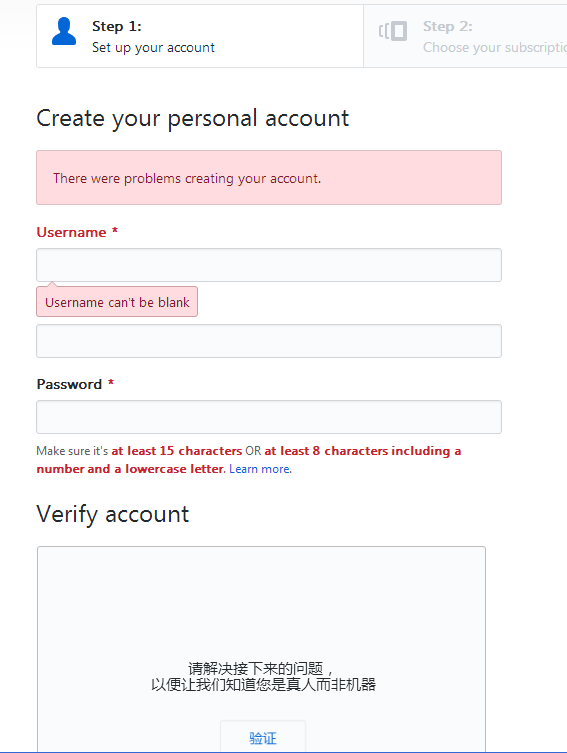
直接continue
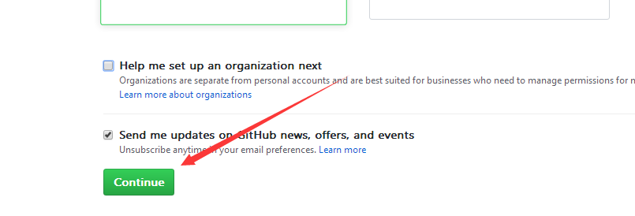
翻译一下，看心情添。。。
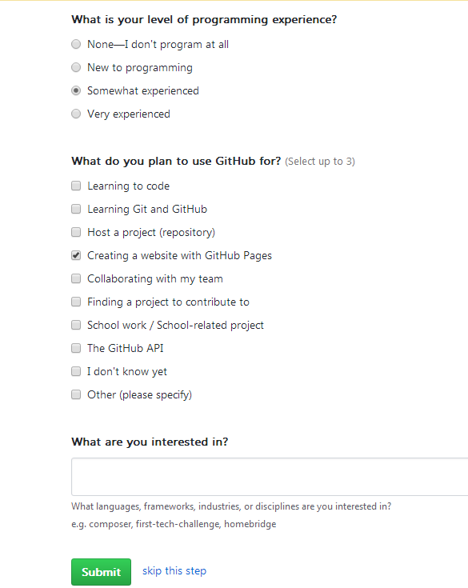
然后去邮箱里验证一下就可以啦。。

登上我们的github账号。
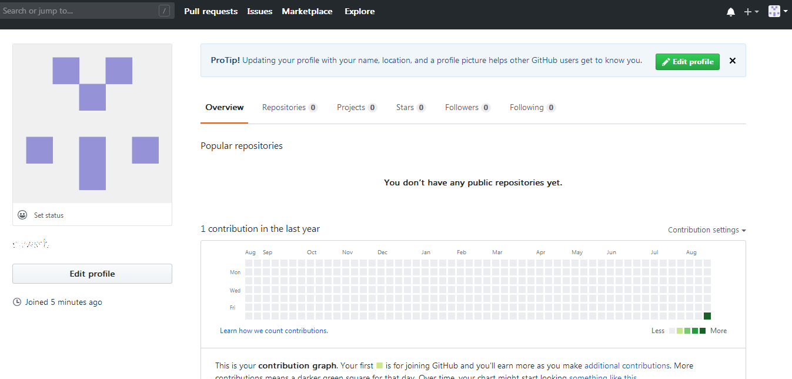

哇，我是有github账号的人啦2333

### 创建仓库
点击右上角的加号，选择newrepository。
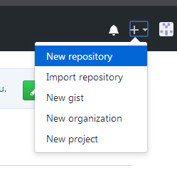
然后对仓库信息进行设置。注意箭头标识的几个地方。仓库名必须是username.github.io的形式。必须勾选public。下面那个用readme填充最好也选上，避免麻烦。
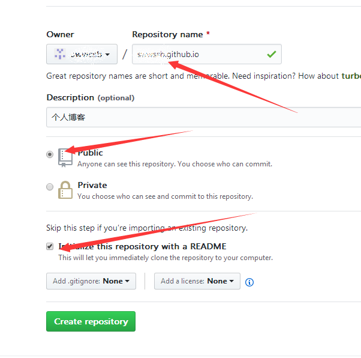
然后就有了一个用来搭建博客的仓库了。
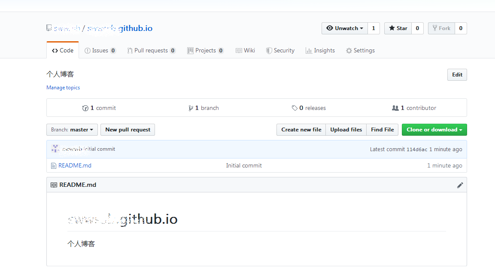
### 挑选主题
下面我们就可以去挑选自己中意的主题了。前面讲过，此方法只适用于jekyll主题的博客。所以下面就以jekyll主题博客为例咯。

在这里你可以找到很多这种主题。挑一款自己喜欢的吧。

点进去一款主题，可以点击Demo预览。选好之后download即可。
由于站长已经咕了很多年。所以这个网站上很多主题已经不能预览了。
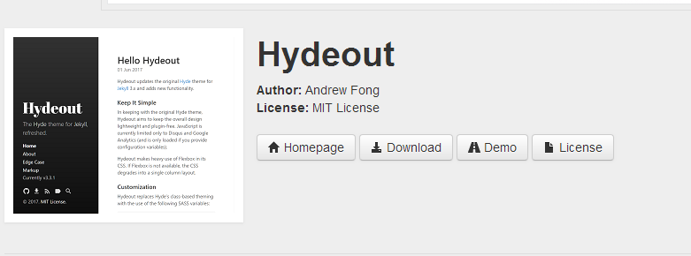

### 修改主题
我们将下载下来的主题解压。可以见到大概如下文件(不一定完全相同)。
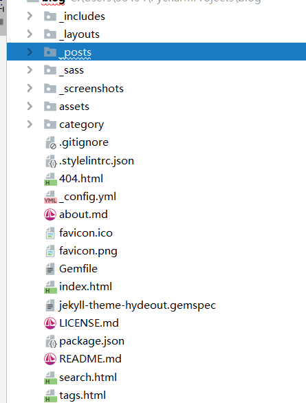

如果你对这些css代码和html有一定了解，那么你可以展开思维任意魔改了。

如果你是个新手，那么就跟随我来进行简单的修改，将博客变为自己的吧。

打开config.yml，将里面的信息修改为自己的。
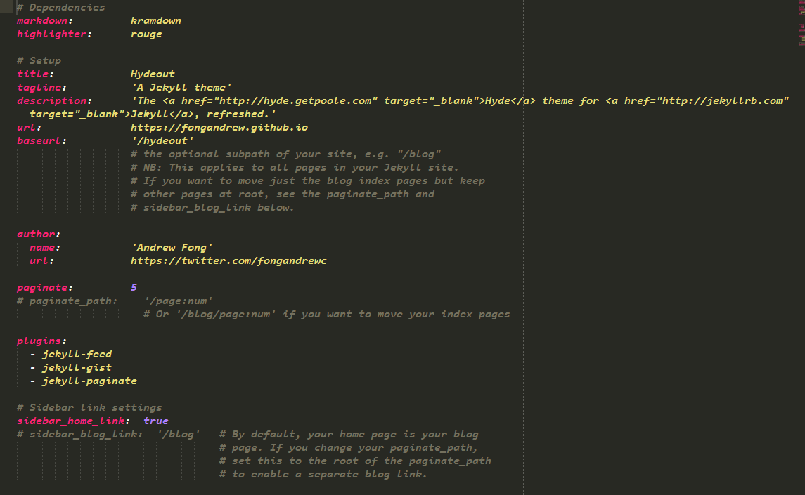

然后进入_posts文件夹，将里面自带的文章删除(删之前注意查看这些文章的起名格式和里面的书写格式，以后写文章会用到)。当然你想留着也可以。

对于不同的主题，这里要改的内容不尽相同。以后慢慢修改就行了。

### 上传主题
回到刚才创建的仓库。然后点击Upload。(当然也可以使用git，这里为了对大白们友好点。。)
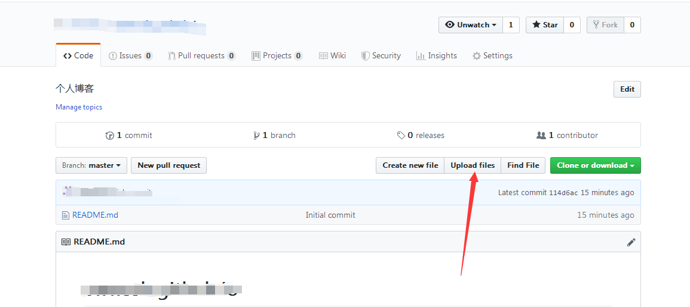
直接将我们的文件拖进去。(不要在外面套文件夹！！)传完之后，点击下方的commit changes
### 查看主题
 然后就可以访问username.github.io(username是你在github上的用户名)查看自己的博客啦。
展示一下我的lj博客(表示换了几次之后更喜欢简洁点的)。。
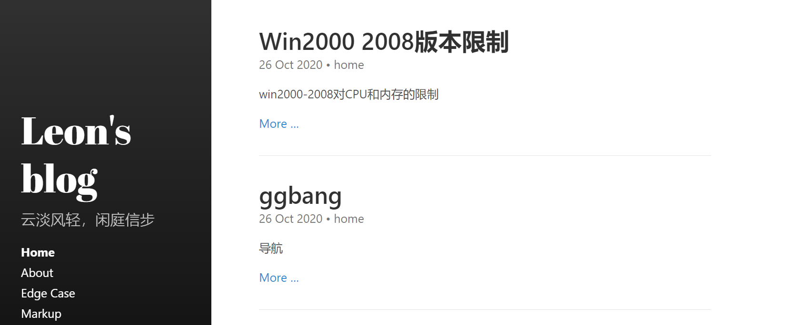

### 更新博客
终于到了重头戏啦。。。下面将如何在浏览器上直接更新博客。并不需要去github上传文件。

### markdown编辑器
首先安利一个makrdown编辑器。

#### 小书匠markdown编辑器
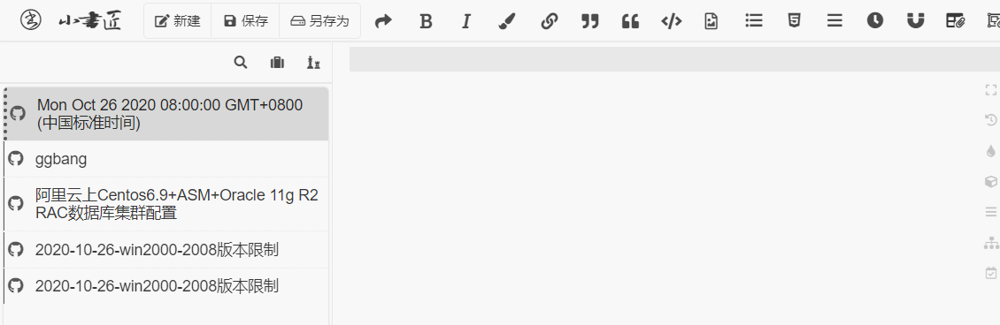
介绍一下他的功能。
1.编写markdown并在线预览(以及大多数编辑器能干的)
2.将图片和文章储存在自己绑定的开源仓库中。

#### 绑定仓库
该编辑器与其他的不同点在于他可以绑定仓库。那么我们如果和刚才自己的博客仓库绑定起来，然后在小书匠上面编辑不就可以在线更新了么。。

首先我们点击左上角的小书匠按钮

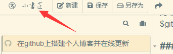

#### 选择绑定
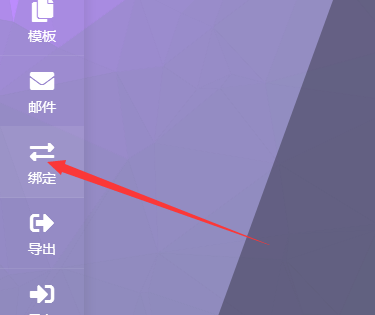

#### 数据储存选择github。
然后他告诉我们需要一个takentoken
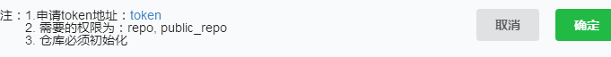

按照他给的链接去申请，需要的权限在刚才小书匠的的申请页面有写，按要求勾选即可(宽心的我一般都是全选啦)。

然后我们复制出来这个takentoken。(注意这个申请之后只能查看一次，建议找个地方保存好。)填写到小书匠里面对应的takentoken框里。然后那个仓库名称就填你的仓库名称(username.github.io)

然后一路确定。

点击中间回到编辑页面。你会看到左下角多了一栏。
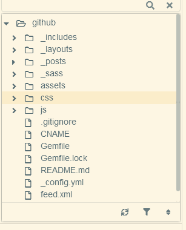

这就是你仓库的文件目录了。

然后我们只要将文章保存到_posts文件夹中就达到了更新博客的目的了。