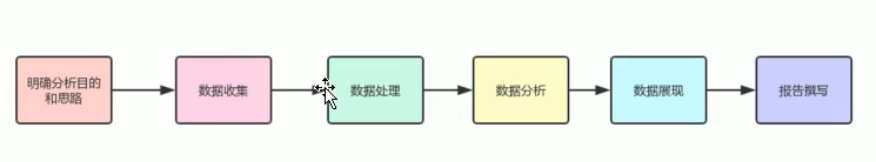

---
layout: post
title: " 大数据初探（1） "
categories: home
tags: "bigdata"
excerpt_separator: <!--more-->
--- 

## 大数据初探学习笔记1
大数据（big data），  
指无法在一定时间范围内用常规软件工具进行捕捉、  
管理和处理的数据集合，  
是需要新处理模式才能具有更强的决策力、  
洞察发现力和流程优化能力的海量、  
高增长率和多样化的信息资产。  
在维克托·迈尔-舍恩伯格及肯尼斯·库克耶编写的《大数据时代》中大数据指不用随机分析法（抽样调查）这样捷径，  
而采用所有数据进行分析处理。  
大数据的5V特点（IBM提出）：  
Volume（大量）、  
Velocity（高速）、  
Variety（多样）、  
Value（低价值密度）、  
Veracity（真实性）。

<!--more-->
#### 数据存储单位详细换算

| 数据存储单位大小换算规则    | -            | -          |
|:--------------------------|:-------------|:-----------|
| 1Byte=8bit （一字节=八位） | 1KB=1024Byte | 1MB=1024KB |
| 1GB=1024MB                | 1TB=1024GB   | 1PB=1024TB |
| 1EB=1024PB                | 1ZB=1024EB   | 1YB=1024ZB |
| 1BB=1024YB                | 1NB=1024BB   | 1DB=1024NB |
|...                           |...              |...            |

### 典型大数据分析流程
- 明确分析目的和思路
- 数据收集
- 数据处理
- 数据分析
- 数据可视化
- 报告填写

1. 数据处理：对收集到的数据进行加工处理，主要包含数据清洗、数据转化、数据提取、数据计算等方法；
1. 数据分析：指使用适当的分析方法及工具，对处理过的数据进行分析，提取有价值的信息，形成有效结论的过程；（Mysql、Hive、HBase、kudu、redis）
1. 数据可视化：通过图形化的方式展示出最终的数据分析结果。

### 大数据部门组织架构

| 平台组            | 数据仓库组                   | 数据挖掘组     | 报表研发组   |
|:------------------|:----------------------------|:--------------|:-------------|
| 大数据平台环境搭建 | ETL工程师                    | 算法工程师    | JAVAEE工程师 |
| 集群性能监控       | HIVE工程师-数仓建模和数据分析 | 推荐系统工程师 |             |
| 集群性能优化       |                             | 用户图像工程师 |             |

