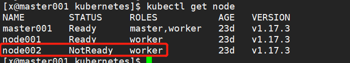

---
layout: post
title: " K8S集群故障排查（一） "
categories: home
tags: " K8S "
excerpt_separator: <!--more-->
--- 

K8S集群故障排查及解决过程
<!--more-->

> 重启集群后，有节点处于NotReady状态

- 状态

    

- 排查思路
    ```
    在节点所在机器通过如下命令查看日志：
    journalctl -f -u kubelet
    ```
- 加载对应组件异常，一般情况下重启集群时，最好同时重启所有节点

> pod处于pending状态

- 排查思路

    ```
    查看对应POD的具体报错  
    kubectl describe pod  ks-account-57cfd766f7-bsrcn -n kubesphere-system  
    ```

> 删除所有状态异常的POD

   - ` kubectl delete pods $(kubectl get pods -n kubesphere-system | grep -v Running | cut -d ' ' -f 1) -n kubesphere-system`


